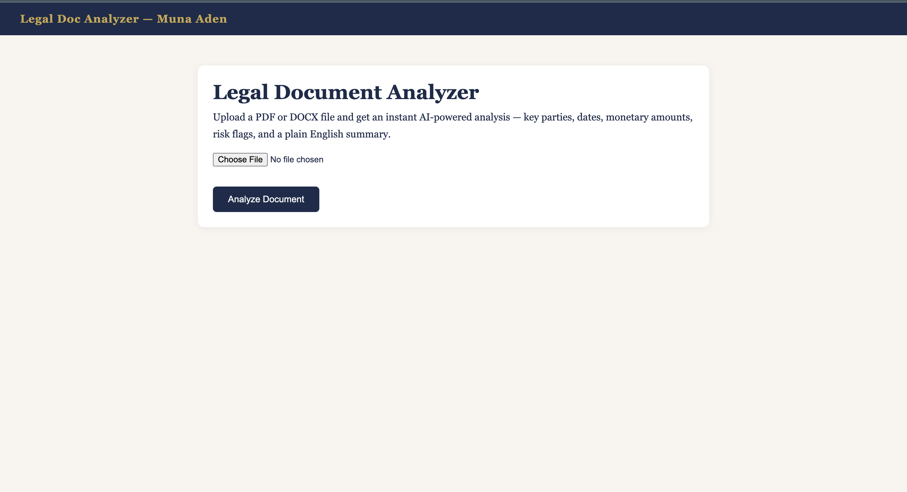

# Legal Document Analyzer

An AI-powered web application that extracts and analyzes key information from legal documents — built with Python, Flask, and Claude AI.

---

## Overview

Upload any PDF or DOCX legal document and get an instant structured analysis in seconds. The tool combines pattern-based extraction with AI to surface what matters — parties, dates, monetary amounts, risk flags, and a plain English summary of what the document is actually about.

Built as a personal project exploring the intersection of technology and law — an area I'm actively pursuing alongside my cybersecurity background.

---

## Features

- **AI-Powered Summary** — Claude reads the document and returns a structured analysis covering document type, key parties, main issues, obligations, and risk flags
- **Date Extraction** — finds all dates mentioned across multiple formats
- **Party Detection** — identifies case-style names (e.g. Dodge v. Ford) and explicit Plaintiff/Defendant labels
- **Monetary Amounts** — pulls all dollar figures including millions and billions
- **Legal Keyword Detection** — flags 25 key legal terms present in the document
- **PDF Export** — download a formatted navy and gold analysis report
- **Error Handling** — friendly error page for unsupported or corrupted files
- **Loading State** — visual feedback while AI processes the document

---

## Tech Stack

| Layer | Tool |
|-------|------|
| Backend | Python, Flask |
| AI Analysis | Anthropic Claude (claude-sonnet-4-6) |
| PDF Reading | PyPDF2 |
| DOCX Reading | python-docx |
| PDF Export | ReportLab |
| Markdown Rendering | markdown |
| Terminal UI | Rich, Click |

---

## Getting Started

**1. Clone the repo**
```bash
git clone https://github.com/muna-aden/legal-doc-analyzer.git
cd legal-doc-analyzer
```

**2. Create a virtual environment**
```bash
python3 -m venv venv
source venv/bin/activate
```

**3. Install dependencies**
```bash
pip install -r requirements.txt
```

**4. Set your Anthropic API key**
```bash
export ANTHROPIC_API_KEY="your-key-here"
```

**5. Run the app**
```bash
python3 app.py
```

**6. Open in browser**
```
http://localhost:5000
```

---

## How It Works

```
User uploads PDF or DOCX
        ↓
Flask receives file → saves to /uploads
        ↓
PyPDF2 / python-docx extracts raw text
        ↓
Regex patterns extract dates, parties, amounts, keywords
        ↓
Claude AI reads first 8000 characters → returns structured analysis
        ↓
Results rendered in styled HTML page
        ↓
Optional: Download formatted PDF report
```

---

## Project Structure

```
legal-doc-analyzer/
├── app.py                  ← Flask backend, routes, extraction logic
├── requirements.txt        ← Python dependencies
├── .gitignore
├── templates/
│   ├── base.html           ← Shared layout and styling
│   ├── index.html          ← Upload page
│   ├── results.html        ← Analysis results page
│   └── error.html          ← Error page
└── uploads/                ← Uploaded files (gitignored)
```

---

## Screenshots

**Upload Page**


**Analysis Results**


**PDF Export**


---

## Why I Built This

Legal and paralegal work involves a lot of manual document review — reading through contracts, case files, and filings to find key dates, parties, and obligations. This tool automates that first pass, surfacing what matters so a legal professional can focus on the analysis that actually requires human judgment.

This project sits at the intersection of my cybersecurity background — where I work with data extraction, automation, and documentation — and my long-term interest in law and technology. It's also my first step into building tools that could genuinely help legal teams work faster.

---

## What's Next

- [ ] Support for more file types (txt, RTF)
- [ ] Clause extraction — identify specific contract clauses
- [ ] Deadline calculator — flag dates that are approaching
- [ ] Multi-document comparison
- [ ] GDPR/HIPAA compliance checker mode

---

## Skills Demonstrated

`Python` `Flask` `REST APIs` `Anthropic Claude API` `PDF Processing` `Regex` `HTML/CSS` `Web Development` `Legal Tech` `AI Integration` `ReportLab`

---

*Built by Muna Aden — B.S. Cybersecurity, SCSU · Exploring the intersection of technology and law*  
*Portfolio: [muna-aden.github.io](https://muna-aden.github.io)*
